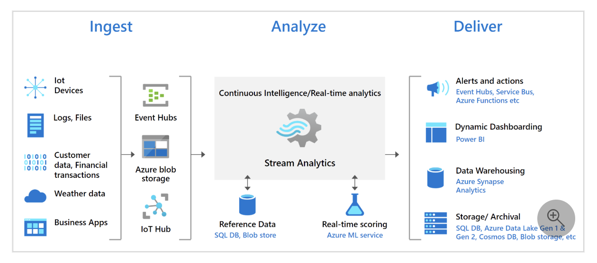

**Proposed Technical Architecture for Near Real-Time Analytical Dashboard on Azure**

---

## **1. Architectural Overview**

To achieve near real-time visualization of bank transactions from a REST API to a ReactJS-based dashboard deployed on Azure, the architecture leverages Azure's robust data engineering and real-time communication services. The design ensures scalability, reliability, security, and low latency, aligning with the requirement of updating the dashboard within **5 seconds** of new transactions.

---

## **2. Architectural Components**

### **1. Data Ingestion Layer**

- **Service:** **Azure Functions**
  - **Type:** Serverless Compute
  - **Trigger:** **Timer Trigger**
  - **Function:** Periodically poll the REST API to fetch new bank transactions.
  - **Frequency:** Configured to run at intervals ensuring updates within 5 seconds (e.g., every second).

### **2. Data Processing and Event Streaming**

- **Service:** **Azure Event Hubs**
  - **Type:** Managed Event Ingestion Service
  - **Function:** Acts as the central event streaming platform to ingest and buffer transaction events.
  - **Features:** High throughput, low latency, scalable partitions.

- **Service:** **Azure Stream Analytics**
  - **Type:** Real-Time Data Stream Processing
  - **Function:** Processes incoming transaction events from Event Hubs, performs filtering, aggregation, and transformation as needed.
  - **Output:** Publishes processed events to **Azure SignalR Service**.

### **3. Data Storage Layer**

- **Service:** **Azure Cosmos DB**
  - **Type:** Globally Distributed NoSQL Database
  - **Function:** Stores transaction data for historical analysis and reporting.
  - **Features:** Multi-region replication, low-latency access, scalable throughput.

### **4. Real-Time Communication Layer**

- **Service:** **Azure SignalR Service**
  - **Type:** Managed Real-Time Messaging Service
  - **Function:** Facilitates real-time communication between backend services and the ReactJS frontend.
  - **Features:** Automatic scaling, high availability, simplified connection management.

### **5. Frontend Application**

- **Framework:** **ReactJS**
  - **Libraries:**
    - **@microsoft/signalr:** For establishing SignalR connections.
    - **Redux:** For state management.
    - **Chart.js / D3.js:** For data visualization.
  - **Function:** Displays real-time transaction data and visualizations, updating dynamically as new data arrives.

### **6. API Management and Security**

- **Service:** **Azure API Management**
  - **Function:** Exposes secure APIs for frontend interactions, manages API routing, throttling, and security policies.
  
- **Service:** **Azure Active Directory (AAD)**
  - **Function:** Manages authentication and authorization for both frontend users and backend services.

### **7. Monitoring and Logging**

- **Service:** **Azure Monitor & Application Insights**
  - **Function:** Provides comprehensive monitoring, logging, and alerting for all components within the architecture.
  
- **Service:** **Azure Log Analytics**
  - **Function:** Centralizes logs for analysis and troubleshooting.

### **8. Infrastructure and Deployment**

- **Service:** **Azure Kubernetes Service (AKS)**
  - **Function:** Hosts containerized components if necessary (e.g., custom microservices).
  
- **Service:** **Azure DevOps**
  - **Function:** Implements CI/CD pipelines for automated building, testing, and deployment of applications and services.

---

## **3. Data Flow & Real-Time Update Mechanism**

1. **Data Ingestion:**
   - **Azure Functions** with a **Timer Trigger** periodically call the REST API to fetch new bank transactions.
   - Retrieved transactions are published as events to **Azure Event Hubs**.

2. **Event Streaming and Processing:**
   - **Azure Event Hubs** ingests the transaction events in real-time.
   - **Azure Stream Analytics** subscribes to **Event Hubs**, processes the events (e.g., filtering, aggregation), and forwards the processed data to **Azure SignalR Service**.

3. **Data Storage:**
   - Simultaneously, **Azure Functions** or **Stream Analytics** can write the transaction data to **Azure Cosmos DB** for persistence and historical analysis.

4. **Real-Time Communication:**
   - **Azure SignalR Service** manages WebSocket connections with the ReactJS frontend.
   - Processed transaction updates are pushed to the connected clients via **SignalR**, ensuring the dashboard reflects changes within the desired latency.

5. **Frontend Update:**
   - The **ReactJS Dashboard** receives real-time updates through the **SignalR** connection.
   - The UI dynamically updates visualizations and data displays to reflect the latest transactions without requiring manual refreshes.

---

## **4. Diagram of the Architecture**

```plaintext
+---------------------+       +----------------------+       +-----------------------+
|                     |       |                      |       |                       |
|  REST API (Data     |       |  Azure Functions     |       |  Azure Event Hubs     |
|  Source)            +-----> |  (Data Ingestion)    +-----> |  (Event Streaming)    |
|                     |       |                      |       |                       |
+---------------------+       +----------+-----------+       +-----------+-----------+
                                       |                               |
                                       |                               |
                                       v                               v
                             +---------+-----------+       +-----------+-----------+
                             |                     |       |                       |
                             |  Azure Stream       |       |  Azure Cosmos DB      |
                             |  Analytics          |       |  (Data Storage)       |
                             |  (Data Processing)  |       |                       |
                             +---------+-----------+       +-----------+-----------+
                                       |                               |
                                       |                               |
                                       v                               |
                             +---------+-----------+                   |
                             |                     |                   |
                             |  Azure SignalR      +<------------------+
                             |  Service            |
                             |  (Real-Time         |
                             |  Communication)     |
                             +---------+-----------+
                                       |
                                       |
                                       v
                             +---------+-----------+
                             |                     |
                             |  ReactJS Dashboard  |
                             |  (Frontend UI)      |
                             |                     |
                             +---------------------+
```

---

## **5. Key Considerations**

### **1. Scalability**

- **Azure Event Hubs** and **Azure SignalR Service** are highly scalable, handling large volumes of events and concurrent connections seamlessly.
- **Azure Functions** can scale out automatically based on the event load, ensuring the ingestion and processing layers can handle spikes in transaction volume.

### **2. Latency**

- The data flow from ingestion to frontend is optimized to maintain end-to-end latency within 5 seconds.
- **Azure Stream Analytics** processes events in real-time, and **SignalR** ensures immediate push of updates to the dashboard.

### **3. Reliability and Fault Tolerance**

- **Azure Event Hubs** ensures durable storage of events with high availability.
- **Azure Functions** and **Stream Analytics** offer built-in retry mechanisms and error handling.
- **Azure SignalR Service** provides reliable message delivery to connected clients.

### **4. Security**

- **Azure Active Directory (AAD)** secures API endpoints and SignalR connections through robust authentication and authorization mechanisms.
- Data in transit is encrypted using TLS, and data at rest in **Azure Cosmos DB** is encrypted by default.
- **Azure Key Vault** can manage sensitive information like API keys and connection strings.

### **5. Monitoring and Observability**

- **Azure Monitor** and **Application Insights** provide end-to-end visibility into the system’s performance, enabling proactive detection and resolution of issues.
- **Azure Log Analytics** aggregates logs from all services for comprehensive analysis and troubleshooting.

### **6. Cost Optimization**

- Utilize **Azure's Consumption-Based Pricing** for serverless components like **Azure Functions** and **SignalR Service** to optimize costs based on actual usage.
- Implement auto-scaling policies to ensure resources are used efficiently.

---

## **6. Summary of the Proposed Solution**

1. **Data Ingestion:** Azure Functions periodically poll the REST API to retrieve new transaction data and publish it to Azure Event Hubs.
2. **Event Streaming:** Azure Event Hubs ingests transaction events, ensuring high throughput and low latency.
3. **Data Processing:** Azure Stream Analytics processes the events in real-time, performing necessary transformations and filtering.
4. **Data Storage:** Processed transaction data is stored in Azure Cosmos DB for historical analysis and reporting.
5. **Real-Time Communication:** Azure Stream Analytics sends processed events to Azure SignalR Service, which manages real-time connections with the frontend.
6. **Frontend Visualization:** The ReactJS dashboard receives real-time updates via SignalR, dynamically updating visualizations to reflect new transactions within 5 seconds.

---

## **7. Benefits of the Proposed Architecture**

- **Near Real-Time Performance:** Ensures that new transactions are reflected on the dashboard within the required latency.
- **Scalability:** Azure's managed services scale automatically to handle varying loads, ensuring consistent performance.
- **Reliability:** Built-in redundancy and fault tolerance across Azure services minimize downtime and data loss.
- **Security:** Robust security measures protect sensitive financial data and ensure only authorized access.
- **Maintainability:** Decoupled components allow for independent updates and easier troubleshooting.
- **Cost-Efficiency:** Serverless and managed services optimize operational costs by scaling based on demand.

---

## **8. Next Steps**

To implement this architecture, consider the following steps:

1. **Set Up Azure Services:**
   - Provision Azure Event Hubs, Azure SignalR Service, Azure Cosmos DB, Azure Functions, and Azure Stream Analytics.
   
2. **Develop Data Ingestion Logic:**
   - Create Azure Functions to poll the REST API and publish transactions to Event Hubs.

3. **Configure Stream Processing:**
   - Define Stream Analytics jobs to process events from Event Hubs and output to SignalR and Cosmos DB.

4. **Develop the Frontend Dashboard:**
   - Build the ReactJS application with SignalR integration to receive and display real-time updates.

5. **Implement Security Measures:**
   - Integrate Azure Active Directory for authentication and secure all service communications.

6. **Set Up Monitoring and Logging:**
   - Configure Azure Monitor and Application Insights to track system health and performance.

7. **Deploy and Test:**
   - Deploy the solution to Azure, conduct thorough testing to ensure latency requirements are met, and validate real-time data flow.

---

By following this architectural blueprint, you can build a robust, scalable, and secure analytical dashboard on Azure that visualizes bank transactions in near real-time, meeting the business requirements effectively.



